# KhadijAcademy

KhadijAcademy est une application scolaire développée avec **React TypeScript** pour le frontend et **Spring Boot** pour le backend. L'application intègre un **API Gateway**, un **Service Registry** et un système d'authentification basé sur des **tokens**.

Le backend repose sur un microservice unique et comprend plusieurs modules : **classes, cours, année académique, étudiants et professeurs**.

---

## 📌 Notions clés

### 🔹 Service Registry
Le **Service Registry** enregistre uniquement les services (comme les microservices).

**Ce qu’il fait vraiment :**
- Stocke les adresses et ports des services.
- Permet aux services de se découvrir et de communiquer.
- Met à jour les services en cas de changement (nouvelle instance, suppression, etc.).

### 🔹 API Gateway
L'**API Gateway** est un point d’entrée unique qui dirige les requêtes vers les bons services.
- Elle **ne s’enregistre pas** forcément dans le Service Registry.
- Toutefois, elle peut l'utiliser pour savoir où envoyer les requêtes.

---
## 🚀 Installation et Exécution

### ✅ Prérequis
Assurez-vous d'avoir les outils suivants installés :
```plaintext
- Node.js et npm
- Java 17+
- PostgreSQL
- Maven
- Docker
```
### 🔹 1. Cloner le projet
```sh
git clone https://github.com/KhadidjatouDIA/KhadiJAcademy1.git
```
---

## 🖥️ Démarrage des services

### 🔹 2. Lancer le Frontend
```sh
cd front_kadiaSchool
npm install
npm run dev
```
Accédez à l'application via : http://localhost:5173
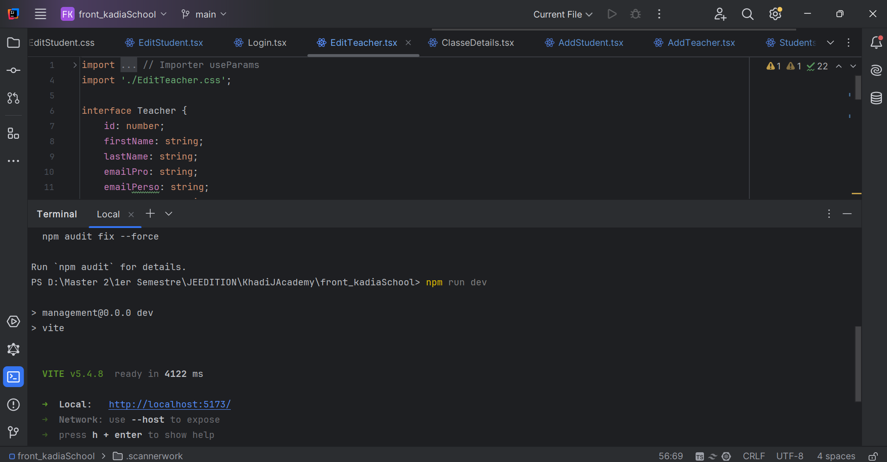

### 🔹 3. Lancer le Backend
Assurez-vous que **PostgreSQL** est configuré et en cours d'exécution.
```sh
cd backend_KadiaSchool
mvn spring-boot:run
```
Votre appli est en cours....
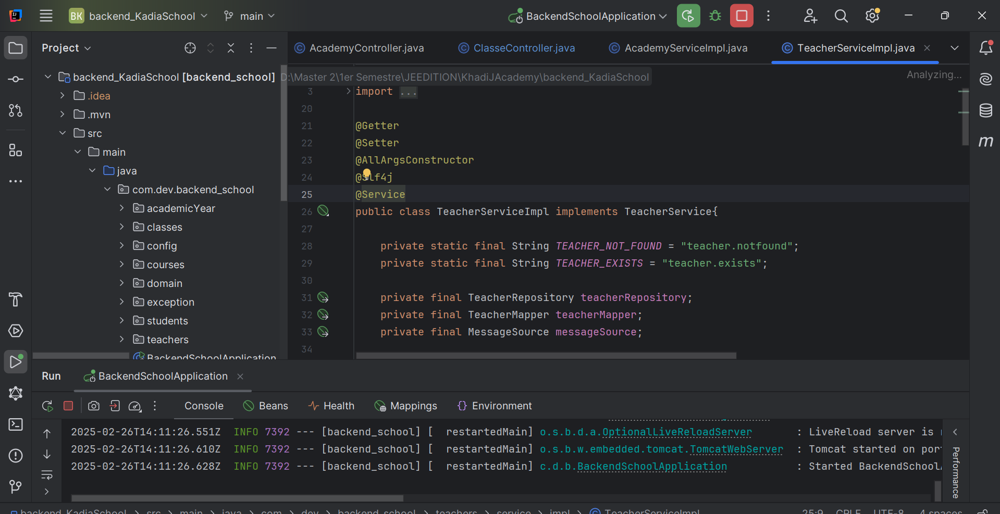

### 🔹 4. Lancer le Service Registry (Eureka)
```sh
cd registry-main
mvn spring-boot:run
```
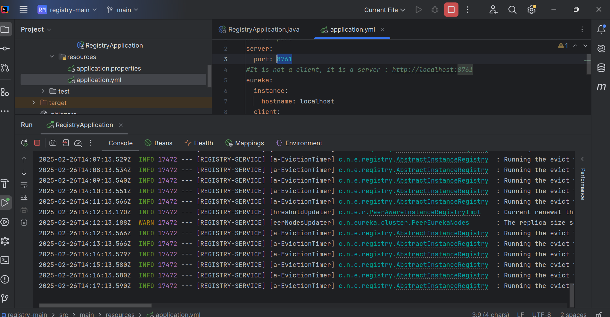
Interface Eureka disponible sur : [http://localhost:8761](http://localhost:8761)
- Vérifiez que votre **API Gateway** apparaît sous le nom `GATEWAY-BACKENDSCHOOL`.
- Si ce n'est pas le cas, assurez-vous qu'elle est bien démarrée.
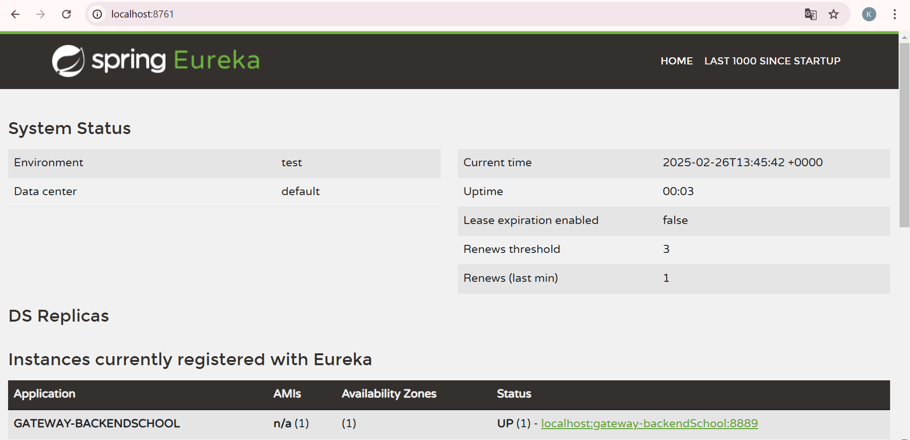

### 🔹 5. Lancer l'API Gateway
```sh
cd api-gateway
mvn spring-boot:run
```
Ceci permet d'enregistrer l'API Gateway dans le **Service Registry**.
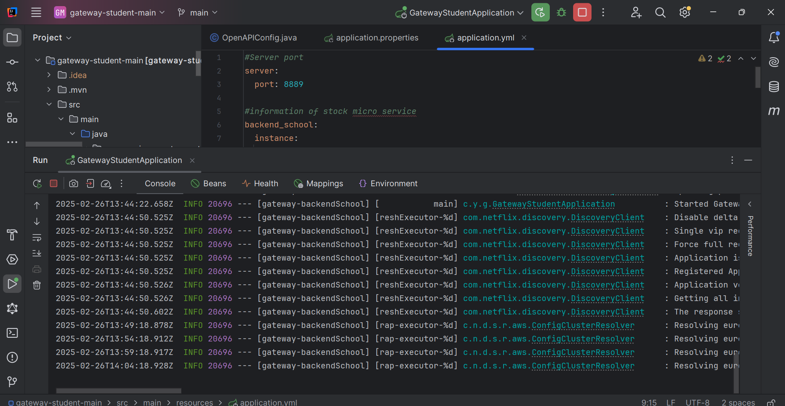
---

## ✅ Vérification des fonctionnalités

### 🔹 Frontend
- Connectez-vous pour accéder au **Dashboard**.
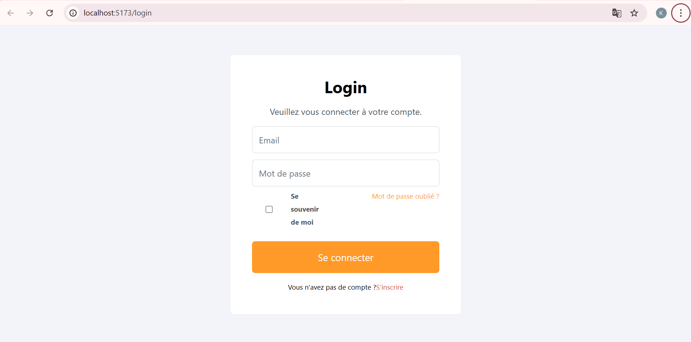
Voilà votre dashboard: 
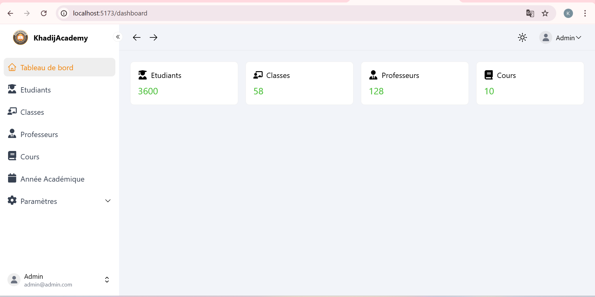


### 🔹 Backend
Testez les endpoints avec **Postman** :

- **Étudiants** 📚
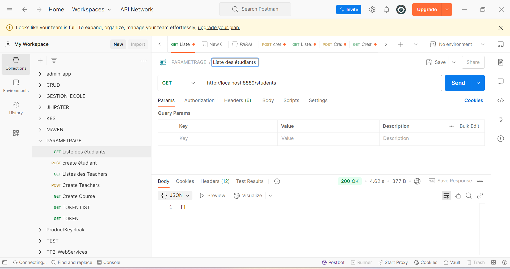
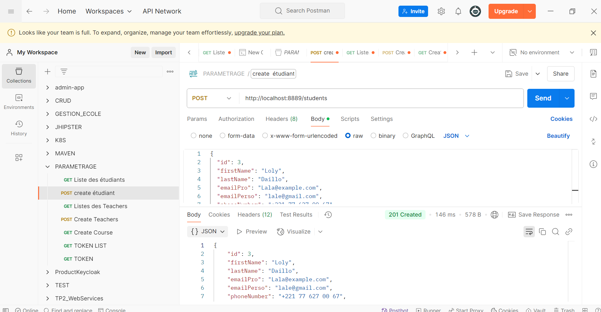
- **Professeurs** 👩‍🏫

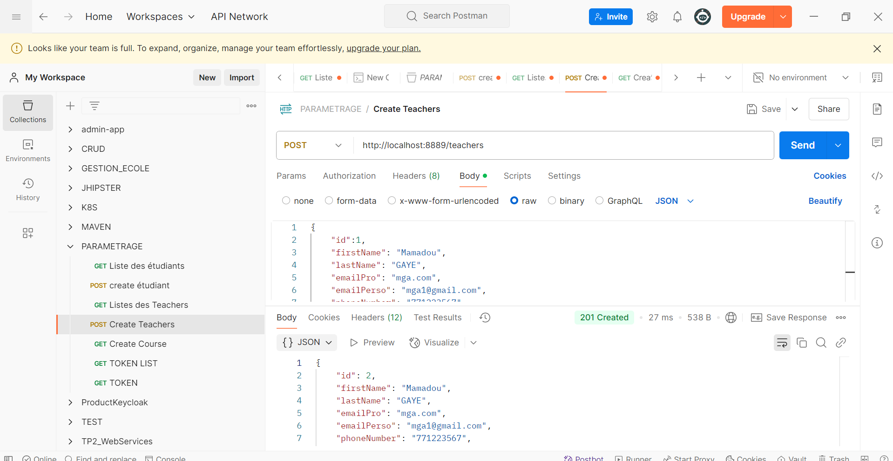
- **Tester pour les autres classes: Cours, Année Académique, Classes** 🎓

### 🔹 Authentification & Tokens
1. **Démarrer Keycloak** avec Docker.

2. **Configurer les tokens** correctement.
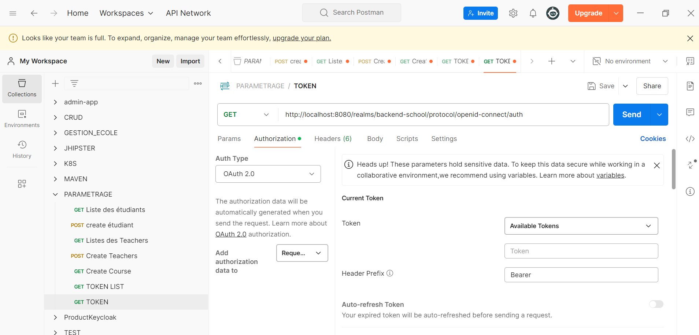
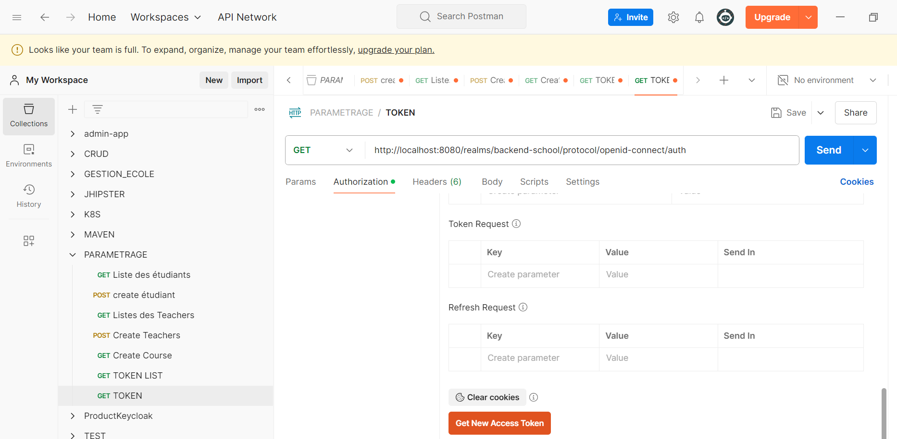
3. **S'authentifier** pour obtenir un token et tester les endpoints sécurisés.
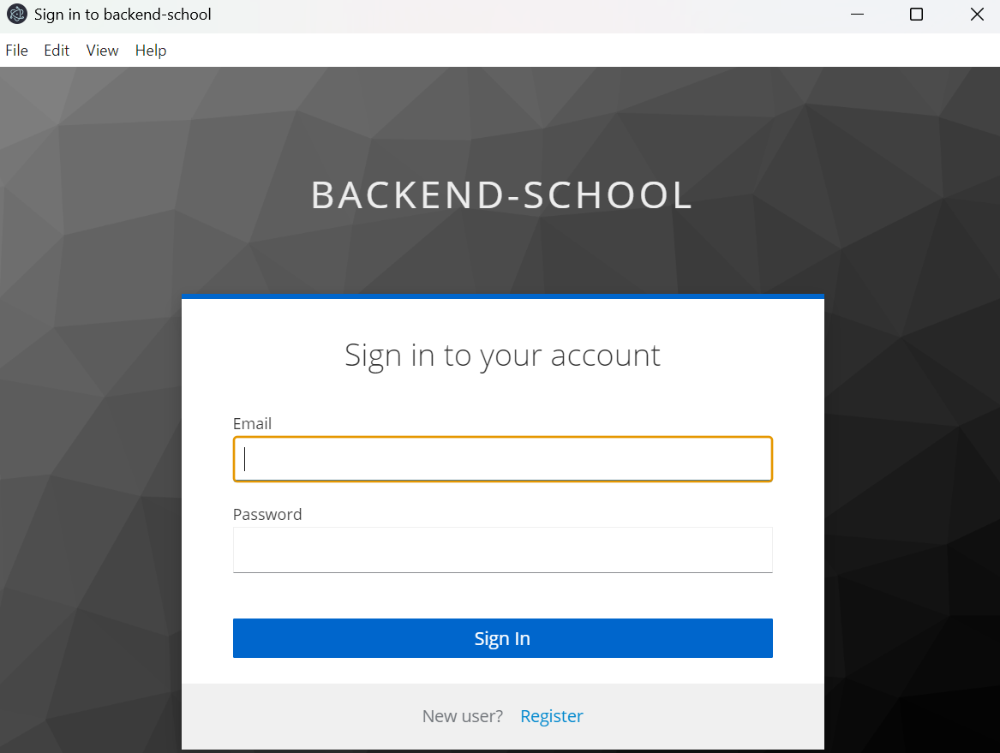
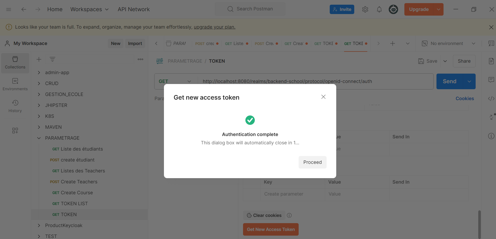
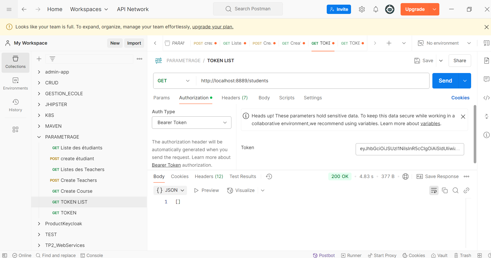
- Faites pour chaque classe de votre application.
---


## 🤝 Contributions
Les contributions sont les bienvenues !
- **Forkez** le projet.
- **Proposez des améliorations** via des **Pull Requests**.

📌 Bon développement avec **KhadijAcademy** 🚀


Auteur : KhadidiatouDIA /sokhnakhadidjah@gmail.com